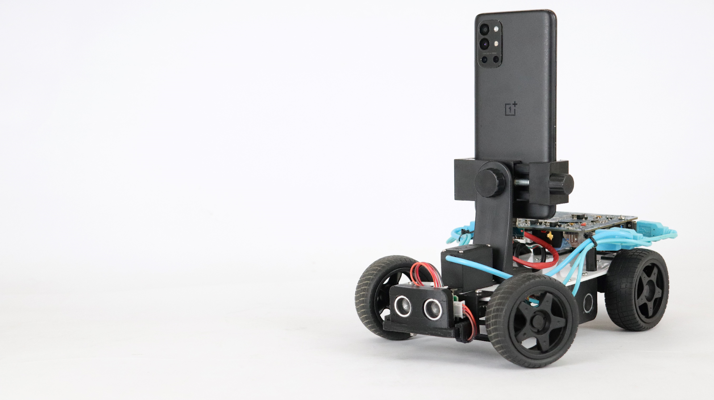
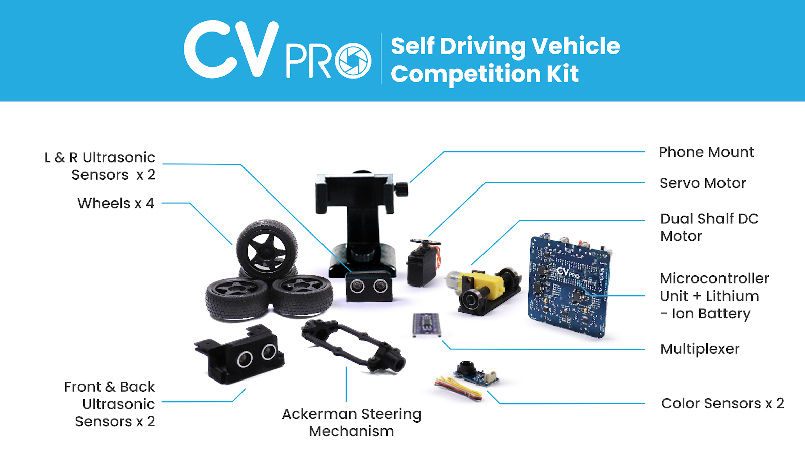
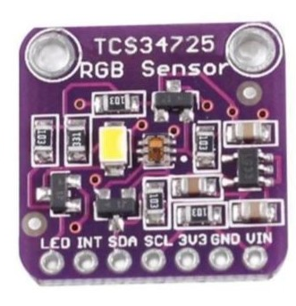
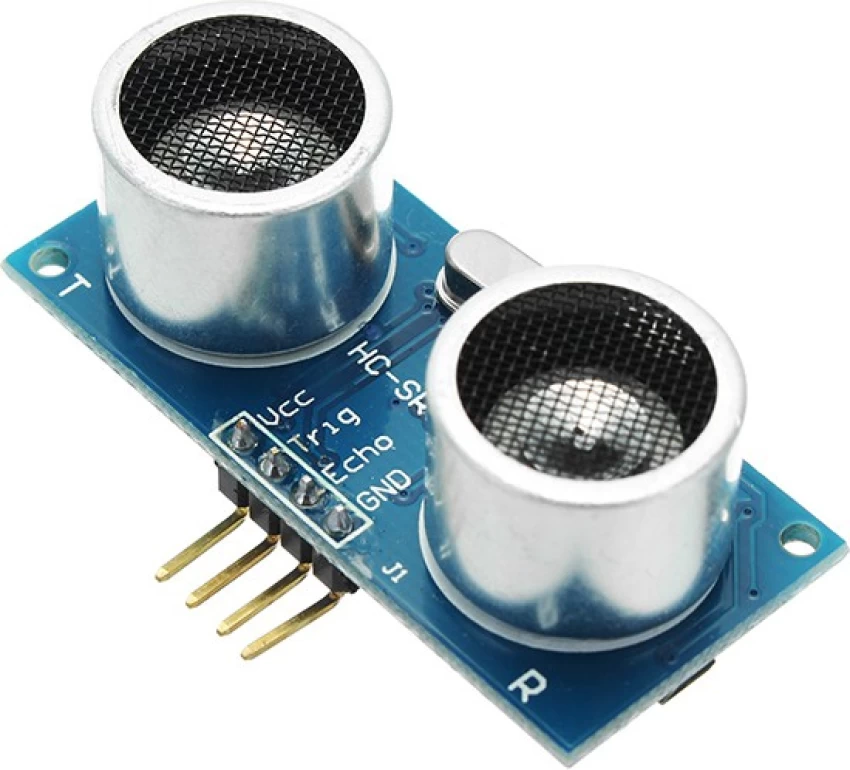

## COMPETITION KIT
<p align="center" width="100%">
    
</p>

The CV Pro Competition kit is crafted for the future engineers who compete in various competitions, opening the door to the realm of autonomous technology, and enabling exploration in the sphere of cutting-edge innovations.The kit empowers users with functionalities including color sensors and ultrasonic sensors for color detection and obstacle avoidance during navigation. It can effectively monitor its surroundings using these sensors and even follow a specified color path when programmed accordingly. Our CV Pro competition kit seamlessly integrates with Android mobile phones for optimal compatibility and performance.

## Get the source code

- You can download the repository as a [zip file](https://github.com/robotixdevteam/CVPro-Competition-Kit/archive/refs/heads/master.zip) and extract it into a folder of your choice.
- You can clone the CVPRO-Competition-Kit repository from GitHub with the following command:

    ```bash
    git clone https://github.com/robotixdevteam/CVPro-Competition-Kit
    ```

## Mechanical Parts
<p align="center" width="100%">
    
</p>

## Hardware - PCB Ports and Usages
<p align="center" width="100%">
    
</p>

## Modules and components

**`Note`**: For the board installation and setup in the [Arduino IDE](https://www.arduino.cc/en/software).

### ESP32 Board

<p align="center" width="100%">
    
</a>

The PCB contains an ESP32 as a controller. It is a versatile microcontroller, combining a dual-core processor with built-in Wi-Fi and Bluetooth capabilities. It's highly efficient and ideal for various IoT applications. Its dual-core architecture supports multitasking, making it efficient for both processing and communication tasks. With a wide range of GPIO pins, it's flexible for interfacing with sensors, motors, and other devices. Additionally, its low power consumption and compatibility with numerous development platforms make it a popular choice for IoT projects and beyond. __Important Note:__ To install the ESP32 board in your Arduino IDE, follow the [link](https://randomnerdtutorials.com/installing-the-esp32-board-in-arduino-ide-windows-instructions/)

### TCA9548A I2C 8 Channel Multiplexer Board

<p align="center" width="100%">
    
</p>

The TCA9548A is an I2C (Inter-Integrated Circuit) 8-channel multiplexer board. It is designed to expand the capability of I2C communication by allowing multiple I2C devices with the same address to be used on a single I2C bus.
Utilizing the TCA9548A will help resolve the issue of having two I2C color sensors with the same address. By using the multiplexer to direct the communication to the correct sensor via the designated channel, you can effectively work with both sensors in your project without address conflicts.

### I2C Color Sensor

<p align="center" width="100%">
    
</a>

An I2C color sensor is a device that detects and measures colors using the I2C communication protocol. It typically integrates various photodiodes, filters, and electronics to accurately perceive and differentiate different colors. By utilizing an I2C color sensor in this project, you can detect and measure colors accurately, enabling a wide range of applications that require color analysis and processing.

Applications: I2C color sensors find applications in a variety of fields, including industrial automation, consumer electronics, robotics, healthcare, automotive, and more. They are used for color sorting, color matching, display calibration, and various other color-related applications.

### HC - SR04 Ultrasonic Sensor

<p align="center" width="100%">
    
</a>

The HC-SR04 Ultrasonic Sensor is a widely used device for measuring distances based on the time it takes for ultrasonic waves to bounce back from an object. It consists of a transmitter that emits ultrasonic waves and a receiver that detects the waves. By calculating the time between emission and reception, the sensor determines the distance from the object. With a measurement range of 2 cm to 400 cm, Easy to interface with microcontrollers, the HC-SR04 sensor offers reliable and accurate distance measurements, making it a popular choice in the electronics and robotics communities.

### PCB inbuilt functions

1. Charging and discharging - _Charging will only be enabled if the bot is in `OFF` state_.
2. **`Green LED`** will indicate when the bot is fully charge in off state. (Ensure that bot runs for 50 minutes from time of full charge condition).
3. Li-ion `3.7V` single cell `3200mAh`.
4. Power module for powering the board, sensors and motors
5. Motor driver for controlling the motor
6. ESP32 micro controller for executing both wired and wireless communications and algorithms. The programming can be done through the given Type-C port. 

<p align="center" width="100%">
    
</p>


## Port and Pin Details 
### Table 
|    ***Function***   |  ***Port Type***    |  ***Port No*** |                      ***Pins***               |  
|:-------------------:| :-----------------: | :------------: | :-------------------------------------------: | 
|***Motor (Battery Operated Motor)***|    ***USB 3.0***    |   ***1***      |    ***32,33***     |
|***Extra Port (for Battery Operated Motor)***|    ***USB 3.0***    |   ***2***      |    ***25,26***             |
|***BUS (Back Ultrasonic Sensor)***|***USB 3.0*** |   ***3***      |    ***17,19***    | 
|***SM (Servo Motor)***|  ***USB 3.0***  |  ***4***  |  ***27***  | 
|***R & L (Right & Left Ultrasonic Sensors)***|    ***USB 3.0***    |  ***5***  |  ***Right- 2,23 and Left-5,18***   |
|***FUS (Front Ultrasonic Sensor)***|    ***USB 2.0***    |  ***6***  | ***12,4***  | 
|***MUX (Multiplexer)***|   ***USB 2.0***    |  ***7*** |  ***22,21***   | ***-*** |
|***RGB LED***|  ***-***  |  ***-***  |    ***15***   | ***-*** |
|***NSLEEP For Motor***|  ***-***  |  ***-***  |    ***13***   | ***-*** |
|***Battery Voltage Reading***|  ***-***  |  ***-***  |  ***39***  | ***-*** |


Kindly refer to the pins provided in the [above table](#Table) for programming firmware.

### Constraints
1. Ensure that every USB cable is connected to its designated port as specified.
2. The kit's servo angle is fixed at **100 degrees**.
3. The PCB lacks protective covering; avoid placing conductive materials on it.
4. When adjusting the angle, stay within a **25-degree** range to the __left and right of the center angle (100 degrees)__, which allows movement between **75** and **125 degrees**. Deviating beyond these limits may result in damage to the product.
5. Handle with care to avoid wire wear.

### Libraries

- #include <ESP32Servo.h>
- #include <NewPing.h>
- #include <Wire.h>
- #include "Adafruit_TCS34725.h"

**`Note`**: Consider exploring additional compatible libraries as well.

# Android Apps

To work with the CV Pro competition kit, corresponding Android application is required. Build the APK on your computer using the Build option in Android studio; the code is already provided.

## Build the apps

### Prerequisites

- [Android Studio Giraffe | 2022.3.1 or later](https://developer.android.com/studio/index.html) for building and installing the Android Studio.
- Android device and Android development environment with minimum API 29.
- Currently, we use API 33 as compile SDK and API 33 as target SDK. It should get installed automatically, but if not you can install the SDK manually. Go to Android Studio -> Preferences -> Appearance & Behaviour -> System Settings -> Android SDK. Make sure API 33 is checked and click apply.

### Build process

1. Open Android Studio and select *Open an existing Android Studio project*.
2. Select the `CVPRO-Competition-kit/Application` directory and click OK.
3. Confirm Gradle Sync if necessary. To perform a Gradle Sync manually, click on the gradle icon.
  
4. Connect your Android device to computer using USB Cable and make sure USB Debugging in the [developer options](https://developer.android.com/studio/debug/dev-options) is enabled. Depending on your development environment [further steps](https://developer.android.com/studio/run/device) might be necessary. You should see your device in the navigation bar at the top now.
  
5. Click the Run button (the green arrow) or select Run > Run 'android' from the top menu. You may need to rebuild the project using Build > Rebuild Project.
  
6. If it asks you to use Instant Run, click *Proceed Without Instant Run*.
7. The app has three different options in Home screen, **SAMPLE CHALLENGE**, **DATA COLLECTION** and **AUTONOMOUS**, with different functionalities.

# Upload Firmware to the Kit

To start, upload the `CVPRO-Competition-Firmware` into the competition kit, from the Firmware folder in your `CVPRO-Competition-Kit` repository.

## How to connect the Phone and CV Pro Competition kit using connecting cable?

1. Connect the female-end of Type-C-OTG cable with male-end of Type-C-USB cable to establish a link.
2. Connect the Type-C end of Type-C-OTG cable with phone.
3. Connect the Type-C end of Type-C-USB cable with Type-C port on the PCB board.
4. If the connection process is correct, it will seek for permissions on your phone.

# Sample Challenge

- Connect between the phone and the CV Pro Competition kit, using the OTG cable. 
- Access the app's `Home` screen and select `Sample challenge`. Initiate the challenge by tapping on `START`. A countdown timer will then appear.
- The vehicle will autonomously navigate around the track within the specified **90-second timeframe**.  

**`Important Note`**: Follow the steps given below for Data Collection and Autonomous.

## Dependencies

We recommend to create a conda environment for CVPRO. Instructions on installing conda can be found [here](https://docs.conda.io/projects/conda/en/latest/user-guide/install/). The easiest way to create a new environment with all dependencies is to use one of the provided environment files. On Windows, you will also need to install [Microsoft C++ Build Tools](https://visualstudio.microsoft.com/visual-cpp-build-tools/). Based on your operating system, run the corresponding command:

### Environment Setup

First create a new conda environment with the following command:

```bash
conda create -n cvpro python=3.9 -y
```

Next, you need to activate your conda environment:

```bash
conda activate cvpro
```

Once your environment is active, install __TensorFlow__. For optimal training speed, especially on dedicated workstations or computers with dedicated GPUs, we recommend installing the necessary libraries and keeping your GPU drivers up to date. See below for TensorFlow installation commands on different Operating Systems.

#### **Windows**
```
pip install tensorflow~=2.9.0
```

GPU support
```
conda install cudatoolkit=11.3 cudnn=8.2 -y
```

#### **Linux**
```
pip install tensorflow~=2.9.0
```

GPU support
```
sudo apt-get install nvidia-driver-510
conda install -c conda-forge cudatoolkit=11.2 cudnn=8.1 -y
echo 'export LD_LIBRARY_PATH=$LD_LIBRARY_PATH:$CONDA_PREFIX/lib/' >> ~/.bashrc
source ~/.bashrc
```
[Troubleshooting](https://www.tensorflow.org/install/pip#linux)

#### **Mac**
```
conda install -c apple tensorflow-deps -y
pip install tensorflow-macos~=2.9.0
```

GPU support
```
pip install tensorflow-metal~=0.5.0
```
[Troubleshooting](https://developer.apple.com/metal/tensorflow-plugin/)

#### **Additional Requirements**

Make sure you are in the folder within your local CVPRO-Competition-Kit repository. Now, you can install all the remaining dependencies using the following command:

```bash
pip install -r requirements.txt
```
### Notes

- Remember to activate the environment, before running commands in the terminal: `conda activate cvpro`
- If your tensorflow import does not work, try installing via `pip install tensorflow --user`. 

# Establishing Connections and Data Collection:

## How to Set up the Local Connection:

For data collection follow the steps below:

1. Securely place your Android phone on the designated phone-mount within the competition kit and establish a connection with the kit using the OTG cable.
2. Power on the kit and grant the necessary permissions as prompted.
3. Activate the `Mobile Hotspot` option on your computer. Once your computer's hotspot name appears on your phone, initiate the connection process by entering the login credentials.

***Note: If you are unable to establish connection, repeat the steps 2-to-3.***

4. To activate your environment,
    - For **Windows**, Open the Anaconda Prompt,

        ```bash
        conda activate cvpro
        ```

    - For **Linux/Ubuntu**, Open the Terminal,

        ```bash
        conda activate cvpro
        ```

    - For **Mac**, Open the Terminal, 

        ```bash
        conda activate cvpro
        ```
   **Note:** If you receive message `EnvironmentNameNotFound` after this step, create and activate the environment, by following steps in [Dependencies](#Dependencies).

5. Change to the `Controller` folder within the `CVPRO-Competition-kit` repository. Then, open the Anaconda prompt. Alternatively, you can use the command provided below to navigate to this path.

    - command >> cd '_path to the python file which is present in downloaded local `CVPRO-Competition-kit` repository in folder `Controller`_'.

    - Type or paste the following command in Anaconda Prompt, for _only Data Collection and bot control_ use this command. 

        ```bash
        python control.py
        ``` 

6. When the command `python control.py` is executed, a window will appear, displaying the IP address and port number.
7. Tap-on the `Data collection` option on the Home screen of the `CVPRO Competition` application on your Android phone. _Allow the necessary permissions to take pictures and record videos_.
8. A screen will be presented for entering the IP address and port number. Input the `IP_address` and `Port No` shown on your computer into the respective fields on the IP address and port number screen of the `CVPRO Competition` application on your phone.
10. Activate data collection on your competition kit app by toggling the `Log` button to the **on** position.
Gather data by maneuvering the kit along the track. Conclude the data collection process by toggling the `Log` button to the **off** position. You can repeat the data collection process as many times as you prefer.
11. Place the bot on the track and now you can control the bot as well as collect the data based on the control keys which will be displayed after running the above python command.
12. Use the `Zip` button, that acts as a toggle button to compress the collected data. After compression is complete, toggle 'off' the 'zip' button.
13. To disconnect the connection between the computer and phone, tap on the `Disconnect` button and close the pygame window in your computer using `Escape` key or _Close button in Window_.
14. Copy the collected data from the folder `CVPRO_Competition` in your smartphone to your computer. Open the local `CVPRO-Competition-Kit` repository and go to the location -> `Training_Process\Training_Data\Dataset_CVPRO\` and place it in `Self_Driving` folder to enable the movement of bot. 

**Note: Avoid pasting the compressed files directly. Make sure to extract the files first.**

# Training Process

Make sure your conda environment for CVPRO is activated by executing the following command:

```bash
conda activate cvpro
```

The training process can be visualised either in Python script or in jupyter notebook:

- To start in the Python script, navigate to the folder, `Training_Process` within your local `CVPRO-Competition-Kit` repository. Type or paste the following command in Anaconda Prompt,

```bash
python main.py
``` 

- To visualize the same using Jupyter notebook, you can use jupyter notebook file "**main.ipynb**". Type or paste the following command in Anaconda Prompt,

```bash
jupyter notebook main.ipynb
```

After training process is complete, the script will generate two files (best_model_labels.tflite and best_model_labels.txt). The files are saved in the location `Training_Process -> Training_Data -> Save_Model`.

# Model Management
1. Copy the files, `best_model_labels.tflite` and `best_model_labels.txt` and paste into the `Assets` folder in the Android studio application. An Image is displayed below for your reference.

2. Then, connect your phone and computer using USB cable and, for building the project, click on the `Run` button. The `CVPRO Competition` Application will be launched on your phone.
3. Upon launching the application, click the `Settings` button.
4. The `Select Models` screen will appear. Select the newly created model and click `Save` to store the model.

# Autonomous
1. Access the `Home` screen of the app. Choose `Autonomous`, and on the subsequent screen, pick the most recent model from the list of displayed models by tapping on `Model Names` within the **Model** option.
2. Enable autonomous navigation of the competition kit by tapping the `USB`**ON** button. The kit will navigate around the area where the data has already been collected when it is positioned there.

## Contact

- Contact us via [Email](mailto:support@meritus.ai)


